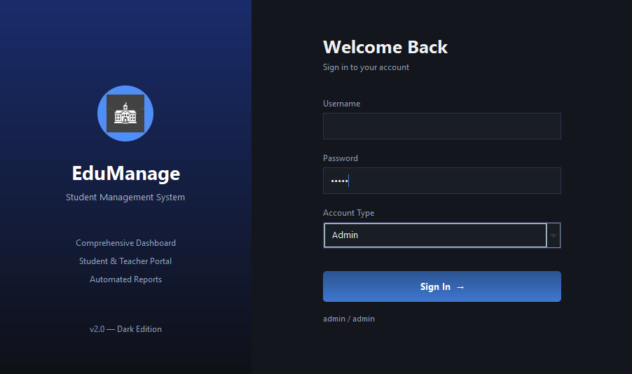
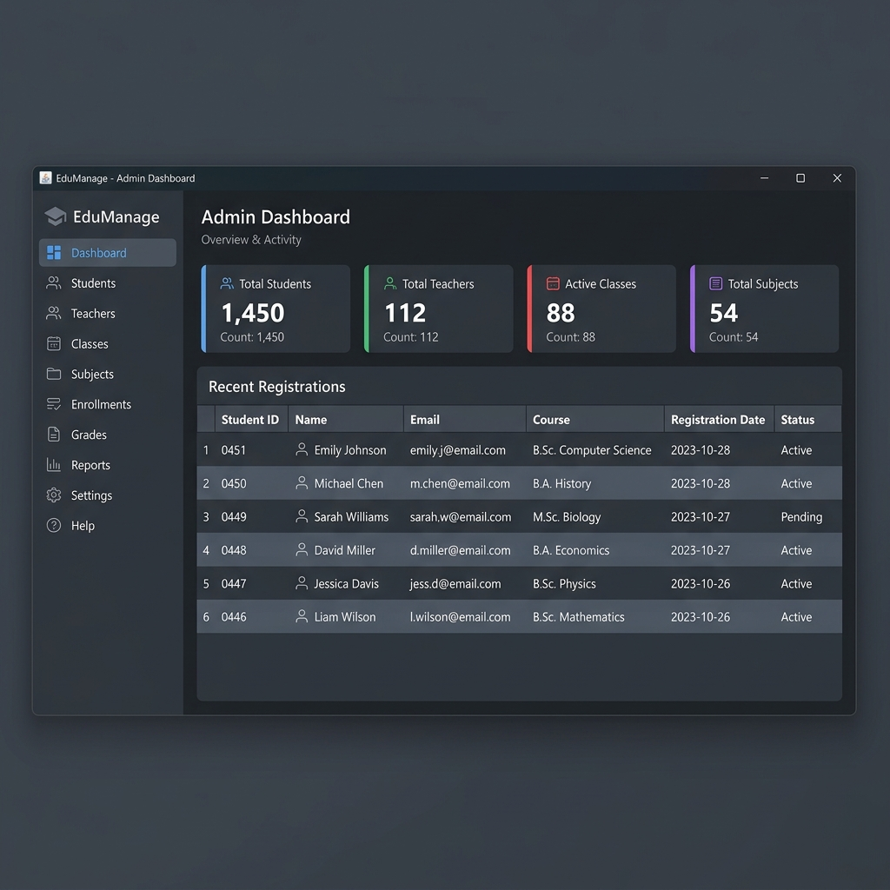
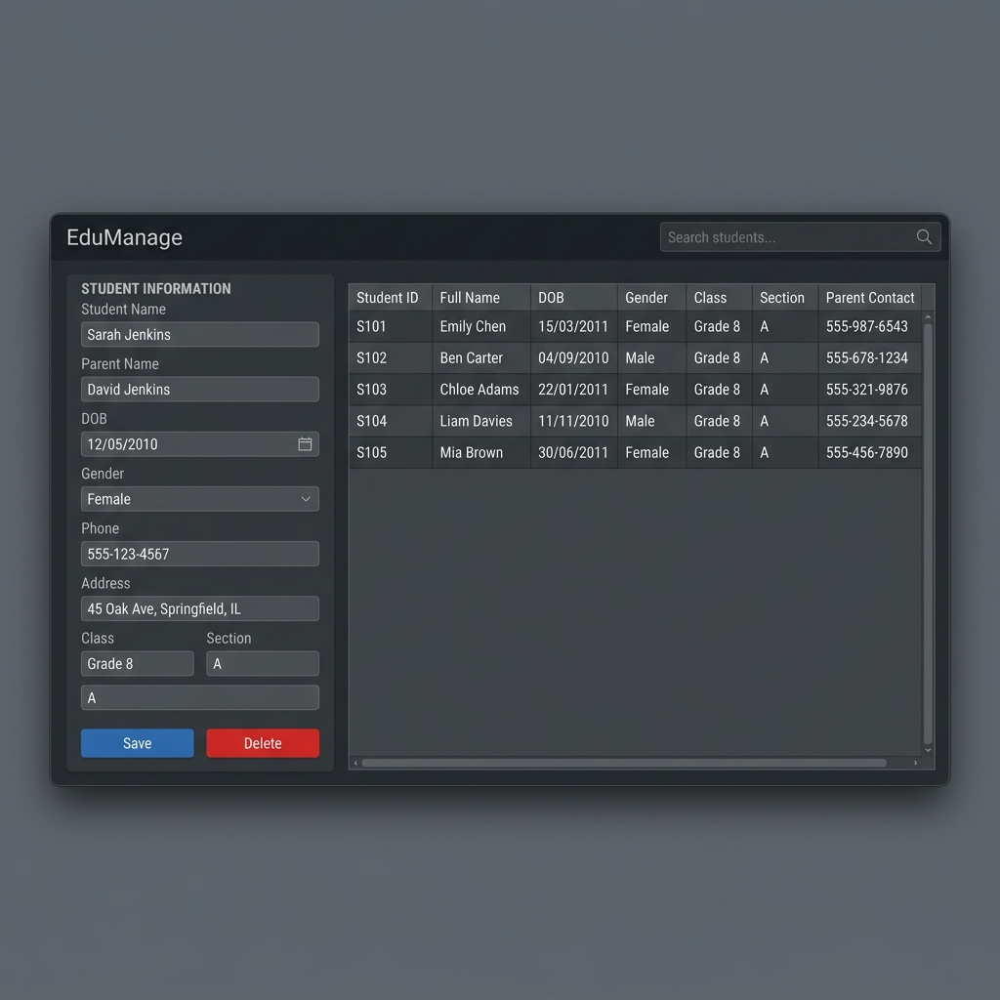

# Student Management System - EAD

A full-featured desktop **Student Management System** built with Java Swing, featuring a modern dark-themed UI. Developed as coursework for the **Enterprise Application Development** module at **NIBM**.

---

## Screenshots

> Login Screen


> Admin Dashboard


> Student Management


---

## Features

| Module | Description |
|---|---|
| Authentication | Role-based login for Admin and Teacher users |
| Student Management | Add, edit, delete, and search student records |
| Teacher Management | Manage teacher profiles and assignments |
| Exam Management | Create and manage exams per class and subject |
| Marks and Grades | Record and view student marks with JasperReports PDF export |
| Class Management | Organize students into classes and sections |
| Subject Management | Add and manage school subjects |
| User Management | Admin panel for creating and managing system users |

---

## Tech Stack

- **Language:** Java (JDK 8+)
- **UI Framework:** Java Swing with custom dark theme (`UITheme.java`)
- **Database:** H2 Embedded Database (portable, no server required)
- **Reporting:** JasperReports 5.6.1 with iText PDF rendering
- **Charts:** JFreeChart 1.0.12
- **Date Picker:** JCalendar
- **Excel Export:** Apache POI 3.10

---

## Database Schema

The application uses an embedded **H2 database** that auto-initializes on first launch. No external database server is needed.

```
users       — System users (Admin / Teacher)
student     — Student profiles
class       — Class and section definitions
subject     — Subject catalogue
exam        — Exam records
marks       — Student marks per subject
```

### Default Credentials

| Username | Password | Role    |
|----------|----------|---------|
| `admin`  | `admin`  | Admin   |
| `Kasuni` | `1234`   | Teacher |

---

## Getting Started

### Prerequisites

- Java JDK 8 or higher installed and added to `PATH`
- Windows OS

### Run the Application

**Option 1 — PowerShell (Recommended)**

```powershell
powershell -ExecutionPolicy Bypass -File run_project.ps1
```

**Option 2 — Batch File**

```batch
run.bat
```

The script will automatically:

1. Create the `build/classes` output directory
2. Build a symlink junction to handle classpath spaces
3. Compile all `.java` source files
4. Copy image and report resources to the build directory
5. Launch the application

> The H2 database file is created automatically at `data/schoolmanagment.mv.db` on first run and seeded with sample data.

---

## Project Structure

```
Student-Management-System-Java-Swing/
├── src/
│   ├── login.java          # Login screen (role-based auth)
│   ├── main.java           # Admin dashboard
│   ├── teachermain.java    # Teacher dashboard
│   ├── student.java        # Student CRUD module
│   ├── teacher.java        # Teacher CRUD module
│   ├── classes.java        # Class management
│   ├── subject.java        # Subject management
│   ├── exam.java           # Exam management
│   ├── marks.java          # Marks entry and PDF reporting
│   ├── user.java           # User account management
│   ├── UITheme.java        # Global dark UI theme and component factory
│   ├── marks.jrxml         # JasperReports marks report template
│   └── images/             # Application image assets
├── lib/                    # All required JAR dependencies
├── data/                   # Auto-generated H2 database files
├── build/                  # Compiled .class output
├── init.sql                # Reference SQL schema script
├── run_project.ps1         # PowerShell build and run script
└── run.bat                 # Batch build and run script
```

---

## User Roles

### Admin

Full access to all modules — can manage students, teachers, classes, subjects, exams, marks, and system users.

### Teacher

Access to the Teacher Dashboard — can view and manage marks and exams.

---

## Dependencies

| Library | Version | Purpose |
|---|---|---|
| h2 | Latest | Embedded database engine |
| jasperreports | 5.6.1 | PDF report generation |
| iText | 2.1.7 | PDF rendering for JasperReports |
| jcalendar | — | Date picker component |
| jfreechart | 1.0.12 | Charts and data visualization |
| Apache POI | 3.10 | Excel export |
| commons-* | Various | Apache Commons utilities |

---

## License

This project was developed for academic purposes at **NIBM** as part of the **Enterprise Application Development** module coursework.

---

<div align="center">
  Adheesha Sooriyaarachchi &nbsp;·&nbsp; Enterprise Application Development &nbsp;·&nbsp; NIBM &nbsp;·&nbsp; 2025
</div>
